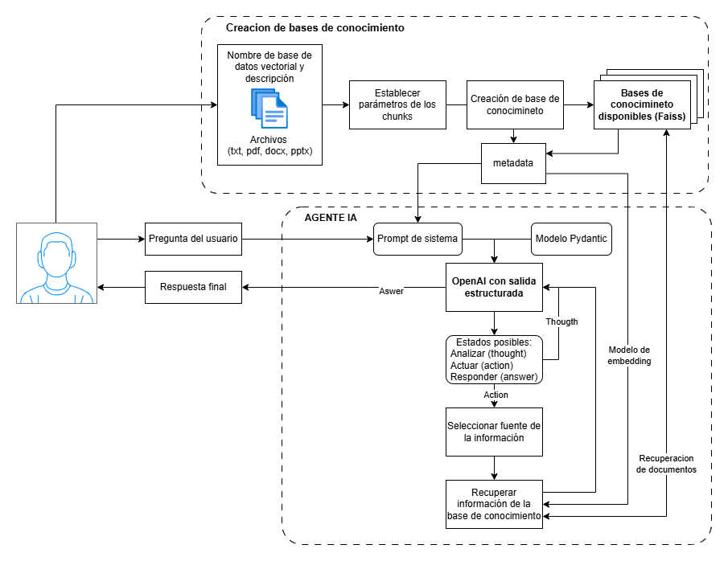

# Asistente de Chat con IA

Una aplicación basada en Streamlit para interactuar con modelos de IA, desarrollada para el curso NLP II de la Maestría en Inteligencia Artificial de la FIUBA.

**Autor**: Juan Ignacio Ribet

## Características

- Sistema de login mockup para identificaion de usuario (posible uso de registro de chats)
- Interfaz de chat y carga de documentos
- Historial de mensajes durante la sesión
- Simulación de streaming de respuestas
- Gestión de documentos y creación de vector stores
- Integración con modelos de OpenAI

## Diagrama de Flujo



## Configuración

1. Clonar el repositorio
2. Instalar dependencias:
   ```bash
   pip install -r requirements.txt
   ```
3. Copiar `.env.example` a `.env` y agregar tu API key de OpenAI:
   ```bash
   cp .env.example .env
   ```
4. Editar `.env` y configurar tu `OPENAI_API_KEY`

## Ejecutar la Aplicación

```bash
streamlit run main.py
```

## Estructura del Proyecto

```
.
├── main.py              # Archivo principal de la aplicación
├── requirements.txt     # Dependencias del proyecto
├── .env                # Variables de entorno (crear desde .env.example)
└── src/
    ├── ui/             # Componentes de interfaz de usuario
    │   ├── pages/      # Páginas de la aplicación
    │   └── components/ # Componentes reutilizables
    └── utils/          # Utilidades y configuración
```

## Instrucciones de Uso

### 1. Inicio de Sesión
- Ingresa tu nombre de usuario en la pantalla de login
- No se requiere contraseña para esta versión demo

### 2. Gestión de Documentos
- Navega a la pestaña "Upload" en el menú lateral
- Sube documentos en formatos soportados (.txt, .pdf, .doc, .docx)
- Configura los parámetros del vector store:
  - Modelo de embedding
  - Tamaño de chunks
  - Solapamiento entre chunks
  - Nombre y descripción del vector store
- Crea el vector store con los documentos subidos

### 3. Chat con Documentos
- Navega a la pestaña "Chat" en el menú lateral
- Escribe tus preguntas sobre los documentos
- El asistente buscará información relevante en los vector stores
- Las respuestas se generarán basadas en el contexto encontrado

### 4. Gestión de Vector Stores
- Puedes crear múltiples vector stores
- Cada vector store puede contener diferentes conjuntos de documentos
- Los vector stores se pueden cargar, eliminar o crear nuevos según necesidad

## Requisitos

- Python 3.8+
- Streamlit
- Cliente Python de OpenAI
- python-dotenv